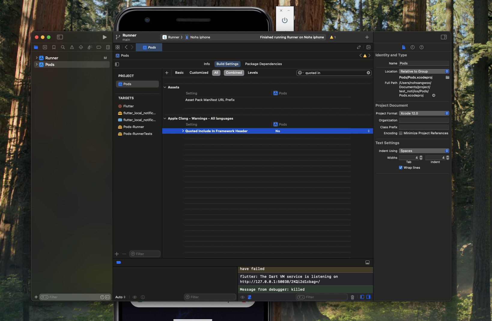

# meditrack

A personalized medication reminder app that helps users who often forget to take their medications on time. This simple yet effective tool sends customized alerts to ensure timely medication intake, making it highly useful for those who struggle with remembering their medication schedules.

# 목적

- 전체적인 배포 흐름을 파악하기 위한 프로젝트
- 한 10개정도 배포해보면 배포 흐름 익숙해질듯
- 심사받고 귀찮은내용들이 많다

# preview

<p float="left">
  
  
  
</p>

<p float="left">
  
  
  
</p>

# deploy

- 앱이름: 약시간 배포완료 ㅋㅋ

# android setting reference

- android/build.gradle
- android/app/build.gradle
- android/app/src/main/AndroidManifest.xml

# ios setting reference

- ref: https://github.com/MaikuB/flutter_local_notifications/blob/master/flutter_local_notifications/example/ios/Runner/AppDelegate.swift

- ios/Runner/AppDelegate.swift

# modules

- flutter_local_notifications - ref: https://pub.dev/packages/flutter_local_notifications
- flutter timezone - ref: https://pub.dev/packages/timezone
- rxdart - ref: https://pub.dev/packages/rxdart

# issue - 1

```
Failed to build iOS app
Could not build the precompiled application for the device.
Error (Xcode): double-quoted include "ActionEventSink.h" in framework header, expected angle-bracketed instead
/Users/nohsangwoo/Documents/project/meditrack/ios/Pods/Target%20Support%20Files/flutter_local_notifications/flutter_local_notifications-umbrella.h:12:8

Error (Xcode): 'Flutter/Flutter.h' file not found
/Users/nohsangwoo/.pub-cache/hosted/pub.dev/flutter_local_notifications-17.2.3/ios/Classes/ActionEventSink.h:12:8

Error (Xcode): (fatal) could not build module 'flutter_local_notifications'
/Users/nohsangwoo/Library/Developer/Xcode/DerivedData/Runner-eyugalixibunstcaofnvzpdcrcru/Build/Intermediates.noindex/Pods.build/Debug-iphoneos/flutter_local_notifications.build/VerifyModule/flutter_local_notifications_objective-c_arm64-apple-ios12.0_gnu11/Test/Test.framework/Headers/Test.h:0:8

Error (Xcode): (fatal) could not build module 'Test'
/Users/nohsangwoo/Library/Developer/Xcode/DerivedData/Runner-eyugalixibunstcaofnvzpdcrcru/Build/Intermediates.noindex/Pods.build/Debug-iphoneos/flutter_local_notifications.build/VerifyModule/flutter_local_notifications_objective-c_arm64-apple-ios12.0_gnu11/Test/Test.m:0:8
2

Error launching application on Nohs iphone.
```



# issue - 2

timezone이 일반적으로 UTC로 설정되어 있어서 한국 시간대로 설정해줘야함.

```
    tz.setLocalLocation(tz.getLocation('Asia/Seoul')); // 한국 시간대로 설정
```

# todos

- 영구저장소에 저장된 기록이 실제로는 파일로 저장된 상태인데 앱을껐다 켜면 provider와 연동이 안됨. ✅
- 알람을 클릭하면 알람 상세페이지로 이동 후 알람이 꺼지는 기능 추가 ✅
- 알람이 꺼지기전까지 5분주기로 계속 알람이 울리게 설정.

- 아이콘 추가 ✅
- app 배포 준비

- 지우는 기능 먼저 구현
- 그다음 알람 재설정 기능 구현(지우고 다시 재설정 하는 형식이라 지우는 기능 먼저 구현해야함)
  (target: cancelAndRescheduleMedicationNotifications in notification_service.dart)

# workmanager를 이용하여 일정시간마다 체크해서 매일 알람을 재설정하는 기능 구현하기

- provider로 등록된 모든 알람에서 오늘 복용체크가 완료됐는지 확인하는 변수를 확인한다.
  (변수이름은 hasTakenMedicationToday)
- 만약 오늘 복용체크가 완료됐다면 알람을 재설정하고 완료되지 않았다면 알람을 그대로 둔다
  재설정하는 알람은 반복되는 알람인 \_scheduleFollowUpNotifications 메서드를 조건에따라 재설정한다.

- ref: https://pub.dev/packages/workmanager

hasTakenMedicationToday을 누른 날짜를 같이 기록한다.(day만 기록)

# workmanager의경우 android에서만 적용됨 ios에서는 적용안됨

- 대안: FCM으로 기능 통일하기.
- usage는 background_service.dart에 남겨둠 시~발~

# FCM 대안내용.

- 1. 약 복용 버튼을 클릭하면 기록과 함께 반복알람 부분만 모두 취소됨
     (notification_service.dart의 \_scheduleFollowUpNotification 참고)
- 2. FCM은 매일 자정 00:00:00에 알람을 예약함

- 3. FCM으로 인해 취소된 알람을 다시 등록.
     간단히 말해서 매일 자정 FCM으로 반복알람을 다시 등록하는것

- 이유: flutter_local_notifications.dart가 일시정지 기능을 제공해주지 않기 때문이다.
  또한 이 작업을 백그라운드로 작업을 진행하려했더니 android와 ios에서 한개의 모듈로 제어하기 어려움.
  따라서 유지 보수 측면에서도 FCM으로 작업을 진행하는것이 좋다.

- FCM으로 설정하면 네트워크요청이 안되는경우 알람이 울리지 않으니깐.

# 알람은 매일 반복되게 설정하고 - 기록을 남기는쪽으로 기획을 틀자, 나중에 니즈가 많아지면 네이티브로 알람일시정지 기능을 추가해보기

- 알람은 지금처럼 반복되게 설정 유지
- 로그 기능을 추가할것임,
- 약먹은 시간 기록을 하단에 리스트 형태로 남기기

# flutter_native_splash

패키지 실행
flutter pub run flutter_native_splash:create

설정을 변경했을 때

flutter pub run flutter_native_splash:remove

flutter pub run flutter_native_splash:create

# 개인정보 처리방침 url 만들기

- ref: https://www.privacy.go.kr/front/per/inf/perInfStep01.do

# keystore 생성

keytool을 이용하여 keystore 생성

```
생성되는 이름과 경로 그리고 aslias를 각각 지정할 수 있음, 예시를 위해 두가지 버전의 명령어를 남겨둠

keytool -genkey -v -keystore upload-keystore.jks -keyalg RSA -keysize 2048 -validity 10000 -alias upload

keytool -genkey -v -keystore ~/key.jks -keyalg RSA -keysize 2048 -validity 10000 -alias key
```

키스토어로 생성된 파일을 이용해서 앱 빌드 진행
android/app/build.gradle에 키스토어 파일 불러오는 방법 추가함(레퍼런스 잡아둠)


# android

1. 수정
2. pubspec.yaml 파일의 version 값을 변경하고, 버전 번호를 증가시키세요.
3. flutter clean
4. flutter build appbundle
5. flutter build appbundle --release --obfuscate --split-debug-info=build/symbols 
(경고 해결)

6. 번들된 파일을 새버전으로 게시하여 검사

- ref: https://luvris2.tistory.com/832

빌드 파일 위치: build/app/outputs/bundle/release/app-release.aab


7. 에뮬레이터 실행 후 
# 그냥 플러터 실행
flutter run  
flutter run -d (디버깅? 디버그 모드?)
flutter run -d 00008130-0004543201F0001C (마지막은 아이디 필요함)

# 무수히 많은 flutter E/FrameEvents( 5424): updateAcquireFence: Did not find frame. 로그 안보이게
flutter run | grep -v "updateAcquireFence"